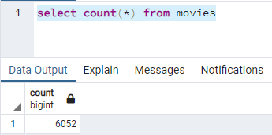
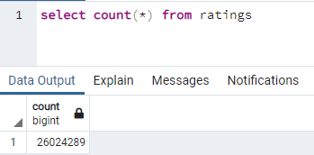

# Movies ETL

## Resources 
Jupyter Notebook, Python, PostgreSQL, pgAdmin
Dependencies: json, pandas, numpy, re, create_engine, psycopg2, time

## Overview 
Amazing Prime needs help to create an automated pipeline that takes new data, performs the appropriate transformations, and loads the data into existing tables. 

## Deliverable 1: Write an ETL Function to Read 3 Data Files
Challenge code: [ETL_function_test.ipynb](ETL_function_test.ipynb)

## Deliverable 2: Extract and Transform the Wikipedia Data 
Challenge code: [ETL_clean_wiki_movies.ipynb](ETL_clean_wiki_movies.ipynb)

## Deliverable 3: Extract and Transform the Kaggle Data 
Challenge code: [ETL_clean_kaggle_data.ipynb](ETL_clean_kaggle_data.ipynb)

## Deliverable 4: Create the Movie Database 
Challenge code: [ETL_create_database.ipynb](ETL_create_database.ipynb)

